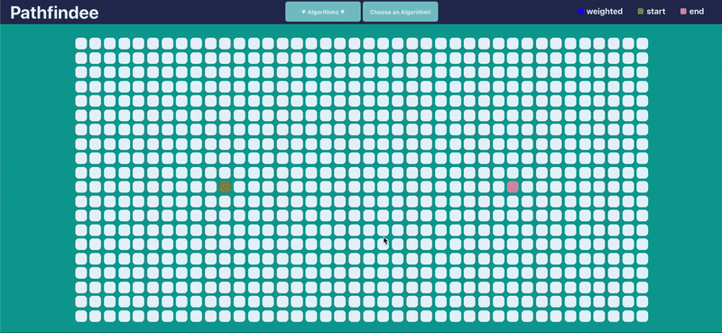

# Pathfindee 

https://johnsonphan95.github.io/pathfindee/

Visualizer is a visualization project I made using React to visualize path finding algorithm's through a coordinate grid.
 


## Features 

Implemented pathfinding algorithms include: 

- A*
- Dijkstra's Algorithm
- Greedy Best-First Search
- Breadth First Search
- Depth First Search

Each square in the grid is initialized as a NodeObject. Each NodeObject has properties like col, row, weight, distance, prev, etc.  
Walls and weighted nodes can be added depending on the algorithm chosen, weighted nodes have a default weight of 10. 

```
const getCost = (node, startNode, endNode, weight = 1) => {
  return (
    (weight / 7) *
      Math.hypot(startNode.row - node.row, startNode.col - node.col) +
    Math.abs(node.col - endNode.col) +
    Math.abs(node.row - endNode.row)
  );
};
```


The code snippet above is the code used to determine the cost to travel to a node in both A* and Greedy's, in this specific example it shows the heuristic used to calculate the cost for the A* algorithm. 
Heuristic used for Greedy Best-First Search is just the Manhattan distance between the current node and the end node. Heuristic algorithm used for A* is just the Manhattan distance between the current node and the end node + Distance between the current node and start node. 


## Available Scripts

In the project directory, you can run:

### `npm start`

Runs the app in the development mode.<br />
Open [http://localhost:3000](http://localhost:3000) to view it in the browser.


This project was bootstrapped with [Create React App](https://github.com/facebook/create-react-app).
